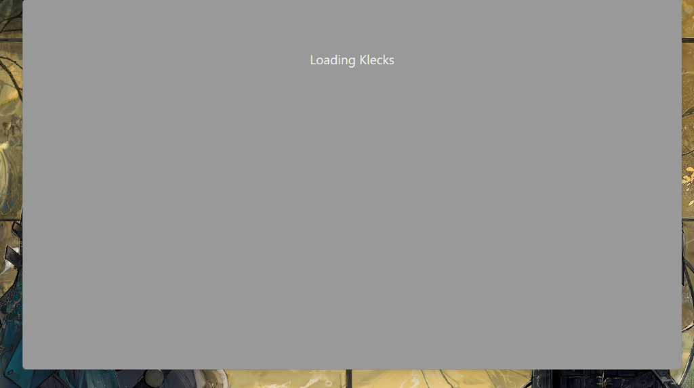
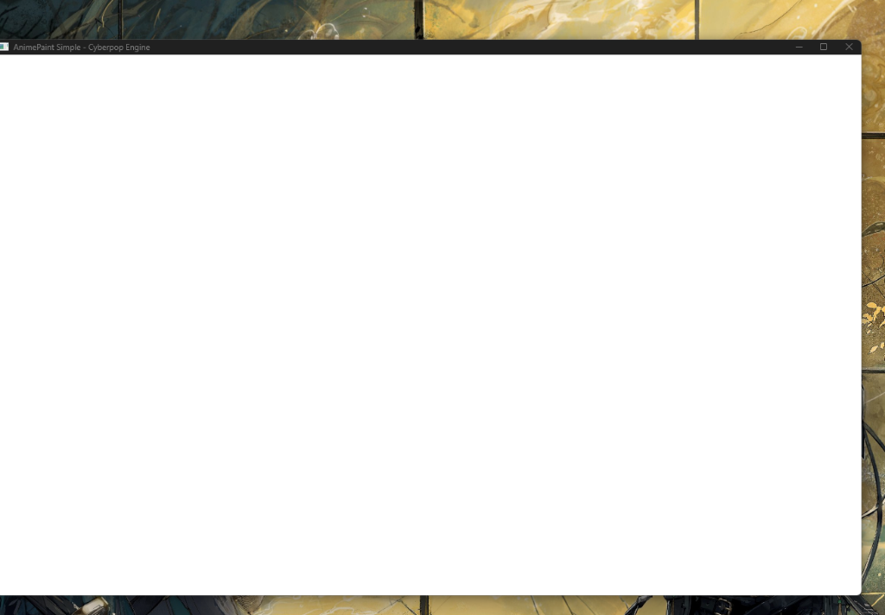
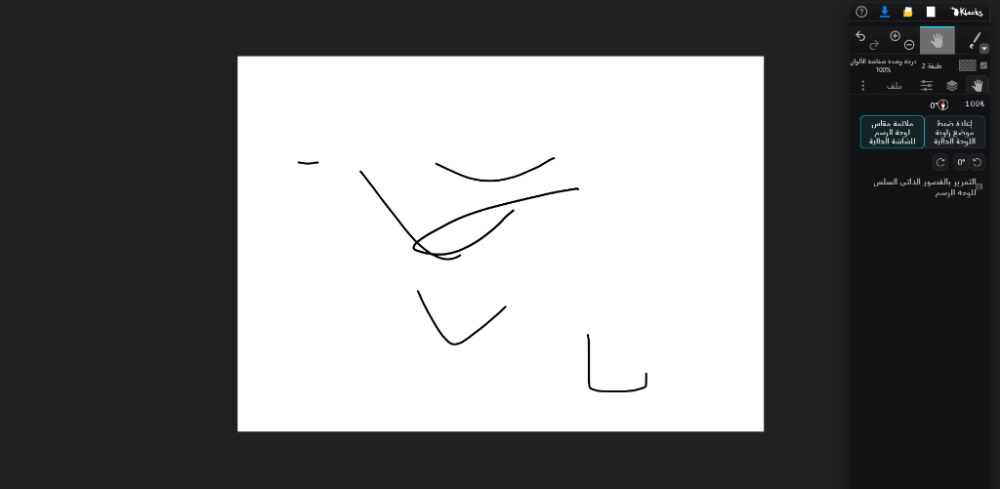

<div align="center">
  <h1 style="border-bottom: none;">AnimePaint - النسخة الخاصة بماريا</h1>
  <p><b>تطبيق الرسم الرقمي والتلوين الأكثر تكاملاً وسرعة لويندوز والويب مع تعريب شامل ودعم كامل لمحاذاة اليمين إلى اليسار</b></p>
  
</div>

---

## مقدمة عن التطبيق
تطبيق الرسم والتلوين الرقمي المتقدم المصمم لبيئات الويب وأجهزة سطح المكتب. تم بناء هذا التطبيق على نواة محرك الرسم مفتوح المصدر Klecks، وتم إدخال تعديلات هيكلية وتوطين كامل للغة العربية لتوفير تجربة مستخدم مثالية وسلسة للرسامين والمصممين في العالم العربي. يتميز التطبيق بتقديم أداء عالٍ وسرعة استجابة فائقة على الأجهزة المتوسطة والضعيفة.

---

## الميزات الاستثنائية للتطبيق

* **توطين متكامل ومحاذاة كاملة**: تعريب عصب ونخاع النظام وقوائم الفلاتر والأدوات مع ضبط اتجاه الكتابة وتدفق الواجهات من اليمين إلى اليسار (RTL) بشكل تلقائي وحتمي.
* **نظام الطبقات الاحترافي**: مرونة تامة في إضافة وحذف وترتيب الطبقات، مع إمكانية تعديل الشفافية واستخدام مختلف أنماط المزج المتقدمة لدمج الألوان.
* **فرش رسم رقمية متنوعة**: تشمل فرش القلم، دلو التلوين الذكي، أداة المزج، الرسم التخطيطي، بكسل آرت، والفرش الكيميائية المسرعة برمجياً.
* **دعم الأجهزة اللوحية وحساسية الضغط**: توافق كامل مع ألواح الرسم الرقمية مع نظام حركي ذكي لتنعيم وتثبيت الخطوط أثناء الرسم الحر لمنع الارتجاف.
* **فلاتر ومؤثرات مدعومة بـ WebGL**: مكتبة مؤثرات بصرية مدمجة تشمل التشويه البصري، تمويه التدرج، فلاتر استخلاص الخطوط الأساسية من الصور، وضبط منحنيات الإضاءة والألوان.
* **أدوات المعالجة والتحويل الهندسي**: أدوات التحويل الحر، تغيير الحجم، قص وتوسيع مساحة العمل، المنظور ثلاثي الأبعاد، وإضافة النصوص العربية المخصصة.

---

## لقطات من واجهة التطبيق

<div align="center">
  <p><b>لوحة التحكم والطبقات المعربة بالكامل مع محاذاة اليمين إلى اليسار</b></p>
  
  
  <p><b>واجهة الرسم والأدوات المتقدمة بوضع الملء الكامل للمستند</b></p>
  
</div>

---

## كيفية التحميل والتشغيل السريع (نظام ويندوز)

تم دمج كامل بيئة التشغيل وملفات المحرك في ملف تنفيذي واحد مدمج ذاتياً لتشغيل البرنامج مباشرة دون الحاجة لتثبيت أي ملفات أو برامج إضافية على جهازك. للتحميل والتشغيل:

1. اذهب إلى تبويب **الإصدارات (Releases)** المتواجد في القائمة الجانبية للمستودع على GitHub.
2. اختر الإصدار الأحدث من القائمة.
3. في قسم **الأصول (Assets)** أسفل تفاصيل الإصدار، اضغط على ملف التحميل:
   `AnimePaint_Maria_Core_Final.exe`
4. بعد اكتمال التحميل، انقل الملف إلى المكان الذي تفضله على قرصك الصلب (مثل سطح المكتب) واضغط عليه مرتين للبدء بالرسم مباشرة.

---

## التقنيات والمحرك الداخلي للمشروع

* **TypeScript & JavaScript (ES6+)**: لكتابة منطق معالجة الرسم وإدارة الواجهات البرمجية.
* **SCSS & CSS3**: لبناء وتصميم الواجهات المتجاوبة مع دعم محاذاة RTL والوضع الداكن الاحترافي.
* **Electron Framework**: لتغليف كود الويب وتحويله إلى تطبيق سطح مكتب سريع يتكامل مع نظام التشغيل.
* **WebGL**: لتسريع عمليات معالجة الرسوم وفلاتر الصور بالاعتماد على كارت الشاشة لضمان سلاسة فائقة.
* **PowerShell & C# Builder**: لإنشاء ملف التشغيل الذاتي الخفيف والصغير الحجم عبر ضغط وحزم ملفات Electron وتشغيلها ذاتياً في مجلد مؤقت عند الفتح.

---

## دليل التطوير والتشغيل المحلي (للمطورين)

لتشغيل المشروع وتعديل الأكواد في بيئة العمل الخاصة بك:

### المتطلبات البرمجية
* تثبيت بيئة Node.js (الإصدار 16 أو أحدث).
* مدير الحزم npm.

### الأوامر البرمجية المتاحة

* **تثبيت الحزم التابعة**:
  ```bash
  npm ci
  ```

* **بناء حزم اللغات المدمجة**:
  ```bash
  npm run lang:build
  ```

* **تشغيل خادم الويب المحلي للتطوير** (تحديث فوري عند حفظ الأكواد):
  ```bash
  npm run start
  ```
  بعد التشغيل، يمكن تصفح التطبيق عبر الرابط: `http://localhost:1234`

* **تشغيل واجهة سطح المكتب (Electron) في بيئة التطوير**:
  ```bash
  npm run electron
  ```

* **بناء الحزمة النهائية للويب** (يتم التصدير إلى مجلد `/dist/`):
  ```bash
  npm run build
  ```

* **تجميع وبناء الملف التنفيذي المدمج النهائي لويندوز**:
  ```bash
  node build_pack.js
  ```

---

## الترخيص والاستخدام
هذا المشروع منشور تحت رخصة MIT المفتوحة. يرجى مراجعة ملف LICENSE لمزيد من التفاصيل.
